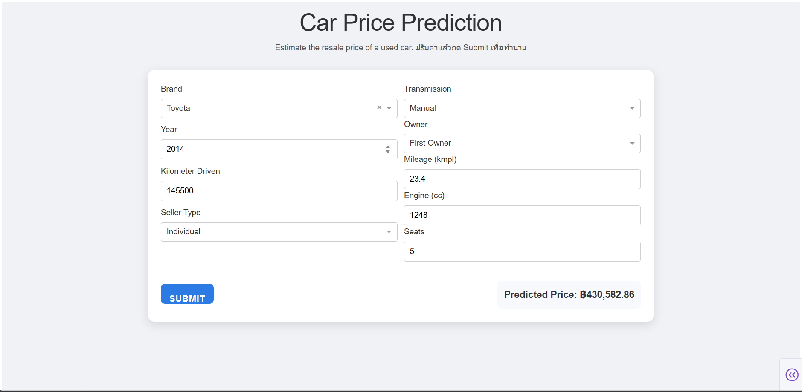

## 🚗 Car Price Prediction Web App       

A simple machine learning web application built with Plotly Dash that predicts the resale price of a used car based on its specifications such as brand, year, mileage, engine size, and other features.       

This project demonstrates how to integrate a trained ML model into an interactive web interface, allowing users to enter car details and instantly get a predicted price.

## How to use?     

There are 2 ways to run this project.          

1. Follow the link : https://51d864f3-8539-4de4-8bd3-25359727cab8.plotly.app/         

2. Run locally
- Clone the repository    

git clone https://github.com/yourusername/car-price-prediction.git     

- python3 app.py

- Navigate to http://127.0.0.1:8050 

## Model Information

Trained Model: CPModel.pkl     
The model was trained using features such as:    

year     

km_driven     

mileage     

engine    

seats    

Brand (one-hot encoded)    

Seller type, transmission, and ownership details    

Scaler: scaler.gz    
Used to normalize numeric features before feeding them into the model.      

The model predict based on trained-data.